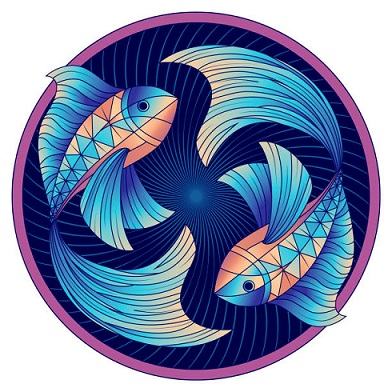

# Šis un tas par mani
Esmu vīriešu dzimtas latvietis pusmūža gados. 
Mani nedaudz varētu raksturot tas, ka esmu pieskaitāms pie introverta tipa un pēc horoskopa esmu zivis. 
Ko tas varētu nozīmēt?
## Introverts

“Tīrus” introvertus vai ekstravertus ir grūti sastapt, jo parasti cilvēki apvieno sevī abus šos raksturu tipus.
### Kāds ir introverts cilvēks

Introverti ne vienmēr ir noslēgti sevī. Vienkārši viņi ir ieciklējušies paši uz sevi. Šādi cilvēki ir ļoti labi klausītāji, bet sarunas uzturēšana viņiem sagādā problēmas. Pēc ballītes introverts iet mājās un priecājas, ka tā ir beigusies. Ar citiem cilvēkiem introverti iepazīstas grūtāk un retāk, arī attiecības parasti ir smagākas.

Introverts ir fantāziju, grāmatu un sapņu cilvēks. Tomēr komunicēt ar citiem cilvēkiem viņš īpaši nemīl. Introverti mēdz būt nedaudz infantīli, šādi cilvēki parasti nevar sasniegt mērķi un uztaisīt karjeru. Ja sagadīsies, ka introverts kļūs par vadītāju, tad viņš būs īstais “pelēkais kardināls”.

Jāsaka, ka lielākā daļa vadītāju ir ekstraverti. Toties strādāt pie dažādiem projektiem parasti uztic introvertiem, jo šajā lietā viņi ir veiksmīgāki.

Avots: https://www.la.lv/ar-ko-atskiras-ekstraverts-cilveks-no-introverta
## Horoskops: Zivis

Saule caur Zivju zodiaka zvaigznāju iet no 18. februāra plkst.19.18 līdz 20. martam plkst.18.15.
### ZIVIS – vīrieši

Vīrieši Zivis ir divu veidu: vieni visu dzīvi meklē lielo izdevību, lai piepildītu savus sapņus un paveiktu ko ievērojamu, otri ķeras klāt pie darāmā un nerimstas, pirms darbs nav padarīts. Vīrietis Zivs ir absolūti bez aizspriedumiem. Viņš vienmēr var atbalstīt ikviena cilvēka viedokli un nekad citus nenosodīs. Draugi vienmēr uztic tiem savus noslēpumus, brīžiem netīkamus un pat šokējošus. Zivs prot saglabāt šos noslēpumus. Tiesa, ja viņu speciāli nebrīdina, lai citiem nestāsta, tad var arī izpļāpāties tā iemesla dēļ, ka nenojauš: šāda veida informāciju kāds var izmantot ļaunā nolūkā. Viņi ir pašu pateicīgāko klausītāju vidū, tādēļ cilvēki bieži vēršas pie tiem pēc palīdzības un padoma. Zivis ir tik jūtīgas pret apkārtējo darbiem un problēmām, ka zināmā mērā viņi jāsargā no uzbāzīgiem draugiem un kaimiņiem aiz tīras līdzjūtības vien. Lai atgūtos no emocionālās pārslodzes, tām nepieciešama atpūta un iespēja pabūt vienatnē vai pie dabas. Zivis ir ļoti jūtīgas un ātri apvainojas.

Daudzi vīrieši Zivis izrāda interesi par visu neparasto: jogu, budismu, astroloģiju, hiromantiju, pārdzimšanas teoriju un citām okultām zinātnēm. Viņi bieži ir gaišreģi un dziednieki. Apbalvoti ar spējām redzēt cilvēkiem cauri, Zivis reti kļūdās viņu patieso centienu izpratnē. Toties pašām Zivīm patīk dažreiz kaut ko izpušķot. Viņu silda apziņa, ka ir savi mazi noslēpumi, ar tiem viņš jūtas pārliecinātāks. Ja jūs tas nekādi netraucē, kādēļ liegt viņam šo prieku?

Zivis reti kļūst greizsirdīgas, bet, ja tomēr, tad tik prasmīgi slēpj, ka nevienam tas neienāk pat prātā. Mīlā vīrietis Zivs ir nevis vadītājs, bet vadāmais. Centieties neizrādīt neapmierinātību, nečīkstiet, nesūdzieties un nekritizējiet viņu. Zivis ir izklaidīgākā no visām zodiaka zīmēm. Palīdziet viņam orientēties viņa lietās un dzīves ceļā jums nebūs uzticamāka un patiesāka cilvēka.

Kā sieva esiet iecietīga pret viņa sapņiem – nesagraujiet tos. Viņš to nekad neaizmirsīs un nepiedos. Palīdziet viņam pārvērst tos īstenībā.

Tēvs Zivs bērniem ir kā dāvana, jo viņš pēc iespējas vairāk palīdzēs piepildīt viņu sapņus, lai tikai redzētu laimē starojošās sejas. Labāku tēvu nav.

Avots: https://www.la.lv/horoskops-zivim-2